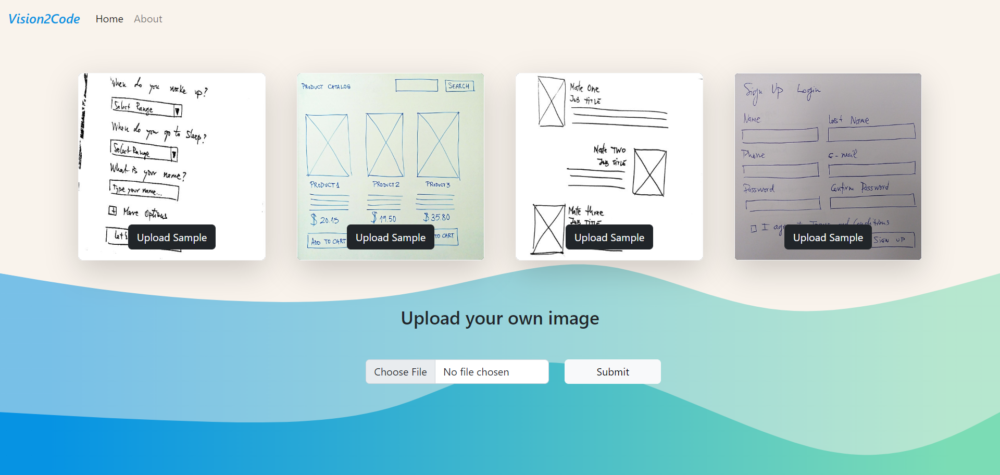

# Introduction

Vision2Code is an website where users can upload hand drawn pictures of html page and it will convert them to an actual HTML Page which you can copy.

  

## Tech Stack
- Python 3.9, flask, Bootstrap 5
- Pytorch 1.12
- Detectron2
- MMOCR
- Airium

## Pipeline

  

Raw image will be converted to an integer array and feed to image reader at the backend which *Pillow* library in our case.

## Sample Generated Output

  

